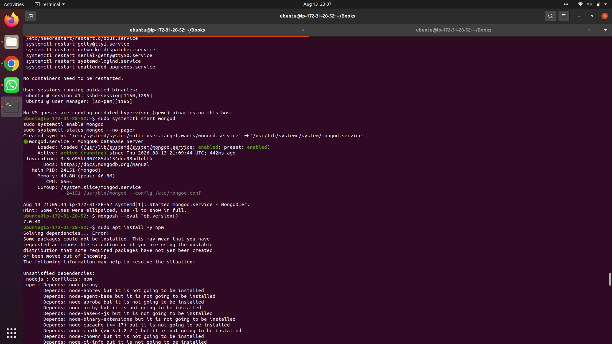
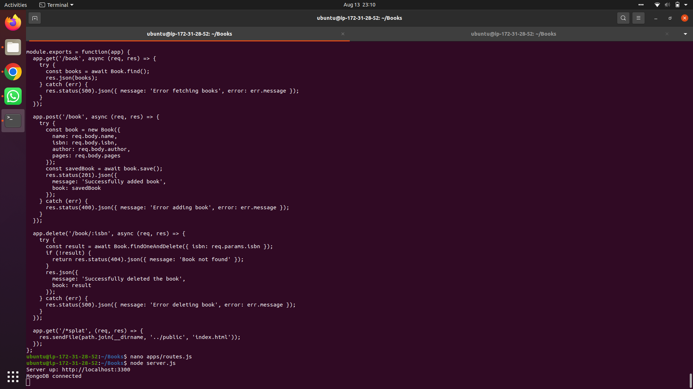
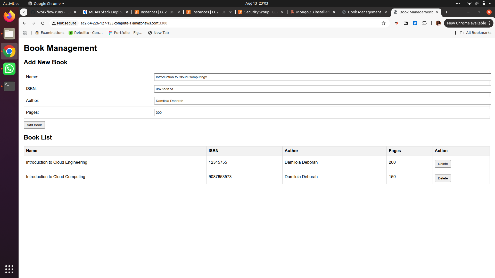

# Book Management App — Node.js, Express, MongoDB & AngularJS on AWS EC2

A full-stack **Book Management** application built with **Node.js**, **Express**, **MongoDB**, and **AngularJS**, deployed on an **AWS EC2** (Ubuntu) instance.

This project demonstrates a complete CRUD (Create, Read, Delete) workflow: a Node/Express backend exposing a REST API, a MongoDB database for persistence, and an AngularJS frontend for the user interface.

---

## Table of Contents

- [Tech Stack](#tech-stack)
- [Project Architecture](#project-architecture)
- [Step 1 — Server Setup](#step-1--server-setup)
- [Step 2 — Database Setup (MongoDB)](#step-2--database-setup-mongodb)
- [Step 3 — Application Code Setup](#step-3--application-code-setup)
- [Step 4 — Models and Routes](#step-4--models-and-routes)
- [Step 5 — Running the Server](#step-5--running-the-server)
- [Step 6 — Exposing the App on EC2](#step-6--exposing-the-app-on-ec2)
- [API Endpoints](#api-endpoints)
- [Author](#author)

---

## Tech Stack

| Layer      | Technology |
|------------|------------|
| Frontend   | AngularJS, HTML, CSS |
| Backend    | Node.js, Express |
| Database   | MongoDB (v7.0) |
| Hosting    | AWS EC2 (Ubuntu) |

---

## Project Architecture

```
Books/
├── apps/
│   ├── models/
│   │   └── book.js       # Mongoose schema
│   └── routes.js         # API routes + frontend catch-all
├── public/
│   ├── index.html         # AngularJS frontend
│   └── script.js
├── server.js               # App entry point
├── package.json
└── screenshots/
```

---

## Step 1 — Server Setup

Update the server and install Node.js and npm using the NodeSource setup script, which installs a properly matched Node/npm pair:

```bash
curl -fsSL https://deb.nodesource.com/setup_lts.x | sudo -E bash -
sudo apt-get install -y nodejs
```

Verify the installation:

```bash
node -v
npm -v
```

---

## Step 2 — Database Setup (MongoDB)

Import the MongoDB public GPG key:

```bash
sudo apt-get install -y gnupg curl
curl -fsSL https://www.mongodb.org/static/pgp/server-7.0.asc | \
   sudo gpg -o /usr/share/keyrings/mongodb-server-7.0.gpg --dearmor
```

Add the MongoDB 7.0 apt repository:

```bash
echo "deb [ arch=amd64,arm64 signed-by=/usr/share/keyrings/mongodb-server-7.0.gpg ] https://repo.mongodb.org/apt/ubuntu jammy/mongodb-org/7.0 multiverse" | \
   sudo tee /etc/apt/sources.list.d/mongodb-org-7.0.list
```

Install MongoDB:

```bash
sudo apt-get update
sudo apt-get install -y mongodb-org
```

Start the database service and enable it on boot. Note that the running service is named `mongod` (short for "Mongo daemon"), not `mongodb`:

```bash
sudo systemctl start mongod
sudo systemctl enable mongod
sudo systemctl status mongod --no-pager
```

Confirm MongoDB is connected and check the version:

```bash
mongosh --eval "db.version()"
```


*`mongod` active and running as a systemd service, with `mongosh` confirming version 7.0.40.*

---

## Step 3 — Application Code Setup

Create the project folder and initialize it with npm:

```bash
mkdir Books && cd Books
npm init
```

Follow the prompts (press `Enter` to accept the defaults) — this generates a `package.json` file.

Install the project dependencies:

```bash
npm install express mongoose body-parser path
```

Create the entry point file:

```bash
nano server.js
```

`server.js` sets up Express, connects to MongoDB, and mounts the app routes:

```js
const express = require('express');
const mongoose = require('mongoose');
const path = require('path');
const app = express();
const PORT = 3300;

app.use(express.static(path.join(__dirname, 'public')));
app.use(express.json());

mongoose.connect('mongodb://localhost:27017/booksdb')
  .then(() => console.log('MongoDB connected'))
  .catch(err => console.log(err));

require('./apps/routes')(app);

app.listen(PORT, () => {
  console.log(`Server up: http://localhost:${PORT}`);
});
```

---

## Step 4 — Models and Routes

Create a `models` folder inside `apps` and define the Book schema:

```bash
mkdir -p apps/models
nano apps/models/book.js
```

```js
const mongoose = require('mongoose');
const Schema = mongoose.Schema;

const BookSchema = new Schema({
  name: String,
  isbn: { type: String, unique: true, required: true },
  author: String,
  pages: Number
});

module.exports = mongoose.model('Book', BookSchema);
```

Create `apps/routes.js` to define the CRUD endpoints and serve the frontend for all other routes:

```bash
nano apps/routes.js
```

```js
const path = require('path');
const Book = require('./models/book');

module.exports = function(app) {
  app.get('/book', async (req, res) => {
    try {
      const books = await Book.find();
      res.json(books);
    } catch (err) {
      res.status(500).json({ message: 'Error fetching books', error: err.message });
    }
  });

  app.post('/book', async (req, res) => {
    try {
      const book = new Book({
        name: req.body.name,
        isbn: req.body.isbn,
        author: req.body.author,
        pages: req.body.pages
      });
      const savedBook = await book.save();
      res.status(201).json({
        message: 'Successfully added book',
        book: savedBook
      });
    } catch (err) {
      res.status(400).json({ message: 'Error adding book', error: err.message });
    }
  });

  app.delete('/book/:isbn', async (req, res) => {
    try {
      const result = await Book.findOneAndDelete({ isbn: req.params.isbn });
      if (!result) {
        return res.status(404).json({ message: 'Book not found' });
      }
      res.json({
        message: 'Successfully deleted the book',
        book: result
      });
    } catch (err) {
      res.status(500).json({ message: 'Error deleting book', error: err.message });
    }
  });

  app.get('/*splat', (req, res) => {
    res.sendFile(path.join(__dirname, '../public', 'index.html'));
  });
};
```

> The final route uses a named wildcard (`/*splat`) rather than a bare `*`, which recent versions of Express/`path-to-regexp` require for catch-all routes that serve the frontend.

---

## Step 5 — Running the Server

From the `Books` root directory:

```bash
node server.js
```

```
Server up: http://localhost:3300
MongoDB connected
```


*The completed `routes.js` file, followed by `node server.js` confirming the server is up and MongoDB is connected.*

---

## Step 6 — Exposing the App on EC2

Open **TCP port 3300** in the EC2 instance's Security Group:

1. **EC2 Console → Instances →** select the instance
2. **Security** tab → click the attached security group
3. **Inbound rules → Edit inbound rules → Add rule**
   - Type: `Custom TCP`
   - Port range: `3300`
   - Source: `My IP` (or `0.0.0.0/0` for open testing access)
4. **Save rules**

Express's `app.listen(PORT, ...)` binds to all network interfaces by default, so no code changes are needed for external access once the port is open.

Visit the app in a browser using the EC2 instance's public IP or public DNS:

```
http://<PublicIP-or-PublicDNS>:3300
```


*The Book Management UI loading successfully over the public IP, before any books have been added.*


*Books successfully added via the form and listed in the table, confirming the full create → read flow works end-to-end.*

---

## API Endpoints

| Method | Endpoint      | Description              |
|--------|---------------|---------------------------|
| GET    | `/book`       | Fetch all books           |
| POST   | `/book`       | Add a new book             |
| DELETE | `/book/:isbn` | Delete a book by ISBN      |

**Example POST body:**
```json
{
  "name": "Introduction to Cloud Computing",
  "isbn": "9087653573",
  "author": "Damilola Deborah",
  "pages": 150
}
```

---
